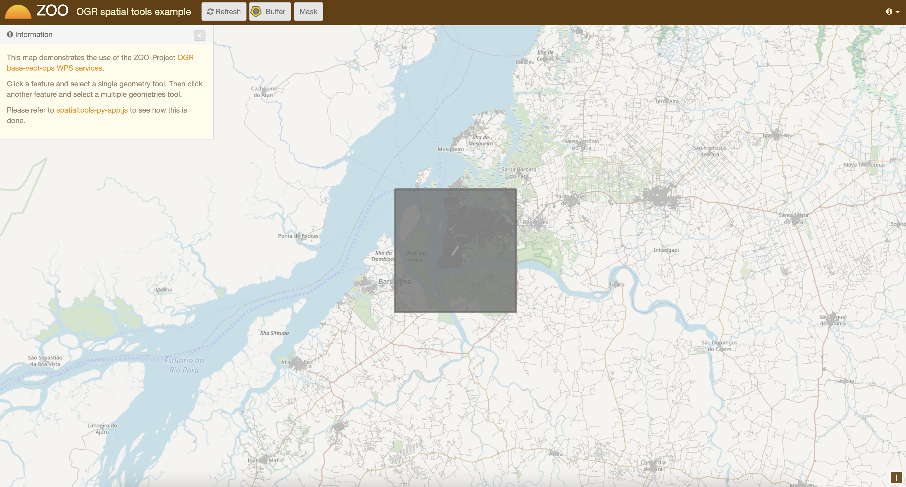

.. _js_service_chaining:

Playing with building blocks
=============================================

.. image:: https://www.svgrepo.com/show/382879/building-blocks-lego-toy.svg
   :width: 50px
   :align: left

.. contents:: Table of Contents
    :depth: 5
    :backlinks: top

Introduction
-------------------------------------------------

This section illustrate how you can use JavaScript on the server-side to chain 
services together to build new ones. You will create a ZOO Services Provider 
using the services you seen before and the WFS server using the ZOO-API. The 
final goal is to query all POIs included in a buffer around a feature and
to highlight them using a mask around this buffer. The following screenshot show
you the expected result:

.. image:: ./images/BufferMaskAndRequest_Level_15.png
   :width: 650px
   :align: center

You can decompose the result above in two different ones: the mask around the 
buffer and the points included in the buffer. So you will create two different 
Services: one called ``BufferMask`` and another one called ``BufferRequest``.

But before implementing any JavaScript Service, you will get an overview of how
to use ZOO-API from your ZOO-Project installation in the next section.

As before, you first create a new directory to store files for your new Services 
Provider:

.. code-block:: guess
    
    mkdir myChain/

ZOO-API Overview
-------------------------------------------------

ZOO-API and ZOO-Kernel JavaScript support make you able to run services 
implemented in JavaScript on the server side. JavaScript is a popular programing
language but mostly used on the client side. Let say from a browser, but here it
is a bit different.

To support JavaScript language ZOO-Kernel use the 
`SpiderMonkey <https://developer.mozilla.org/en/SpiderMonkey>`__ API
to create a javascript runtime environment from which it will load
your JS file then extract the function corresponding to the service to
run it using the prefilled parameters. The JavaScript runtime
environment created by the ZOO-Kernel depend on your setup. If you
placed the ``ZOO-api.js`` and ``ZOO-proj4js.js`` in the same directory
as your ZOO-Kernel it means that your environment will contains
ZOO-API and Proj4js which will be loaded before your service. In such
case you can access to the Classes defined in the JavaScript ZOO-API
to manipulate geographic data, for more informations please refer to
the `ZOO-API Documentation
<http://zoo-project.org/docs/api/index.html>`__.

Even if it can be useful to run JavaScript on the server side, you should 
remember that some basic JavaScript functions you are familiar with does not 
exist or get a different behavior. For instance the simple ``alert`` 
function will display messages in apache error logs rather than in a window when
used from a browser. The ``alert`` function can be used as follow:

.. code-block:: guess

    alert("My alert message");

There is no XMLHttpRequest available in the JavaScript evironement your service 
will run into. Hopefully, the ZOO-Kernel expose a C function to the JavaScript 
world named: ``JSRequest``. This function make you able from your JavaScript 
services to call other WPS services (locally or remotelly) or other kind OGC 
services such as WFS. When you are using the ZOO-API it is possible to call 
Services using a ``ZOO.Process`` instance [#f3]_, to parse WPS Responses using 
``ZOO.Format.WPS`` 
(cf. `ref <http://zoo-project.org/docs/api/zoo-process.html>`__).

As for Python services you already seen in previous sections, the functions 
corresponding to a Service should take three arguments: ``conf``,
``inputs`` and ``outputs`` [#f4]_. Nevertheless, as the ZOO-Kernel is
not able to access the values modified [#f5]_ by the Service code,
rather than returning an integer as in Python, here you'll need to
return both the integer value and the resulting ``outputs``  values as
an Object [#f6]_. You can see in the following an example of a
JavaScript  Service code: 

.. code-block:: none
    
    function SampleService(conf,inputs,outputs){
      outputs["Result"]["value"]=someComputation(inputs);
      return
        {
            result: ZOO.SERVICE_SUCCEEDED, 
            outputs: outputs
        };
    }

Before starting to implement the Services we will need to get our final 
BufferRequest service, let start with a simplier one.

The Mask Service
-------------------------------------------------

In this section you will learn how to create your first JavaScript service which
will simply return a rectangular mask around a selected feature. To build this 
mask you will use the Buffer service to create a buffer big enough around a 
selected geometry to cover a significant part of your map. You can see the 
expected result in the following screenshot:

As before, you will first start by writting the ZCFG, then you will write the 
JavaScript source code and finish by publishing your Services Provider.

The ZCFG
......................

Open a file named 
``myChain/Mask.zcfg`` 
with your favorite text editor and add the following content:

.. literalinclude:: ./files/Mask.zcfg

Here you simply define one default ``ComplexData`` for both ``inputData`` and
``Result``: a GML and a GeoJSON respectively [#f7]_.
 
The JavaScript service
...........................................

As you will have to request the Buffer service many times from your service, you
will first define ``Buffer`` and ``BufferToBBOX`` functions as
follow. It uses the ``ZOO.Process`` to request the Buffer service you
seen in the previous section.

Open a file named 
``myChain/foss4gws.js`` and 
add the following content:

.. literalinclude:: ./files/foss4gws0.js

Publish and use your Service
................................................................

Now you get both your ZCFG and your service code ready, you need to deploy your 
new Services Provider using the following command:

.. code-block:: bash
    
    for i in $(ls myChain);
    do
	docker cp myChain/$i \
		zoo-project-zookernel-1:/usr/lib/cgi-bin/$i ;
    done

Now you are ready to use your JavaScript service by loading the following `url 
<http://localhost/zoows-2024/>`__, click on a street then click on
the "Mask" button.

BufferMask Service
-------------------------------------------------

In this section you will implement a simple JavaScript service which will be able create
a hole in the mask you created in `previous section <#mask-service>`__. This service
will be used to highlight the buffer zone around a selected fature. You get a preview of 
the expected result in the following screenshot:

.. image:: ./images/BufferMask_Level_15.png
   :width: 650px
   :align: center

The ZCFG
................................................................

Open the file named 
``myChain/BufferMask.zcfg`` 
with your favorite text editor and copy / paste the following content:

.. literalinclude:: ./files/BufferMask.zcfg

This ZCFG is similar to the previous one. Please, refer to comments in the 
`previous section <#the-zcfg>`__ for more informations.

The JavaScript service
................................................................

In this Service you will use same source code you used in the
`previous section <#the-javascript-service>`__. Indeed, you should
compute the Mask as you did before then compute Buffer for creating a
hole in the mask to run the Difference service.

.. literalinclude:: ./files/foss4gws1.js

Publish and use your Service
................................................................

Now, you can publish your service as you did `before
<#publish-and-use-your-service>`__. To use your service, please use
the following `url <http://localhost/zoows-2024/>`__.

BufferRequest service
----------------------------

In this section, you will create a new Service: ``BufferRequest`` which will request 
POIs included in the Buffer around a selected feature [#f8]_. You will use the ``poi`` 
layer served as WFS through your local mapserver installation. You can see in the 
following screenshot the expected result: 

.. image:: ./images/BufferRequest_Level_15.png
   :width: 650px
   :align: center

The ZCFG
................................................................

Open the file named 
``myChain/BufferRequest.zcfg`` 
with your favorite text editor and copy / paste the following content:

.. literalinclude:: ./files/BufferRequest.zcfg

The JavaScript code
................................................................

As in the previous Service, you will compute a buffer around the input feature. But then
you will request POIs available in the Buffer extent using a WFS request to use them to 
run ``Intersection`` service using the initial Buffer. The WFS request is useful to limit 
the number of points to use when requesting the ``Intersection`` Service.

.. literalinclude:: ./files/foss4gws2.js

.. warning:: to take advantage of the ZOO-Kernel cache system, you directly use the WFS
    request  as ``xlink:href`` rather than value for ``InputEntity2`` (from line 31 to 34) and use ``text/xml`` ``mimeType`` 
    (on line 40). Indeed, the ZOO-API doesn't use the internal cache mechanisms.

Publish and use your Service
................................................................

Now, you can publish your service as you did `before
<#publish-and-use-your-service>`__. To use your service, please use
the following `url <http://localhost/zoows-2024/>`__.

.. note:: You can click on "Buffer Request and Mask"  to get the same result as presented 
    in  `the initial screenshot <#introduction>`__.

   
Conclusion
----------------------------

After understanding how basic Geometric Operation Services works, here you built step by step new JavaScript services which reuse the previous ones and combine them in different ways. This was achieved using the ZOO-API, composed by C functions exposed by the ZOO-Kernel to the JavaScript services runtime environement and the JS files which can be optionally installed. 

.. rubric:: Footnotes

.. [#f3] The ``ZOO.Process`` class uses ``JSRequest`` (cf. `ref 
    <http://zoo-project.org/docs/api/zoo-format-wps.html>`__). You will get example
    of use `later  <#the-javascript-service>`__.
.. [#f4] So ``conf``, ``inputs`` and ``outputs`` are simple JavaScript objects, similar 
    to the Python dictionaries used in the `previous section <ogr_base_vect_ops.html>`__.    
.. [#f5] Such as ``conf``, ``inputs`` and ``outputs``.
.. [#f6] You can also return a conf Object if you get any informations updated from your JavaScript service (such as cookie for instance)
.. [#f7] Using one of the available ``ZOO.formats`` you are also able to support various
    ``ComplexData`` for both input and output of the service. To simplify the 
    presentation here, you will use only this default ones.
.. [#f8] So in the hole you created in the previous section.
